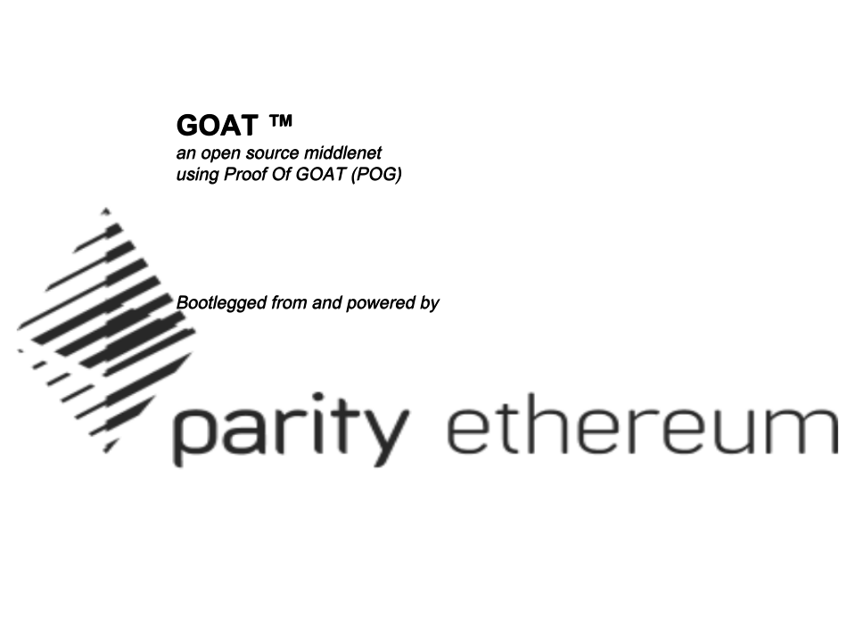

# goat-pilot
files used to configure GOAT  for 3 authorities and 3 nodes.  will add more scripts later if that is what is needed as well.

## GOAT is a 3rd generation protocol layer blockchain or "middlenet" for those who wish to interact with the World of Goat or GOAT CHAIN.  GOAT runs on Proof of GOAT otherwise known as Parity's Aura engine.  I will probably tweak it a bit more in the future.  

## Many Goatitioners try their whole lives but will never even come close to the level of MASTER GOAT and other legendary levels.

## BUILD INSTRUCTIONS

